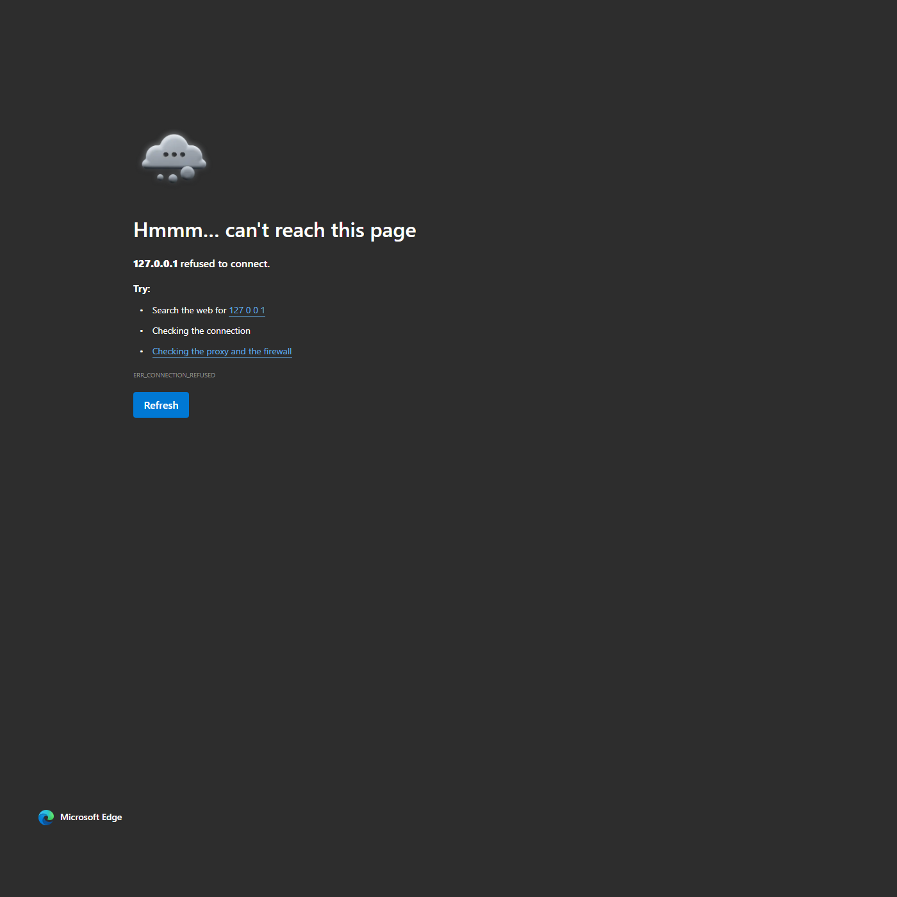

# Neon Snake

A polished browser-based Snake game with a neon arcade visual style, responsive layout, and persistent high-score tracking.



## Overview

Neon Snake is a lightweight front-end game built with plain HTML, CSS, and JavaScript. It runs directly in the browser with no build step and no external dependencies beyond the Google Font used by the UI.

## Features

- Responsive single-page game UI
- Neon arcade-inspired visual design
- Keyboard and button controls
- Pause and restart support
- Increasing game speed as score rises
- Persistent best score saved with `localStorage`
- Canvas-based rendering with overlay states for ready, pause, and game-over flows

## Controls

| Action | Keys / Input |
| --- | --- |
| Move up | `Arrow Up` or `W` |
| Move down | `Arrow Down` or `S` |
| Move left | `Arrow Left` or `A` |
| Move right | `Arrow Right` or `D` |
| Pause / resume | `Space` or the Pause button |
| New game | New Game button |
| Restart after game over | `Enter` or the Play Again button |

## Gameplay

- Start moving with any arrow key or `WASD`
- Eat food to grow the snake and increase your score
- Every food pickup adds `10` points
- The game speeds up as your score increases
- The run ends if you hit a wall or collide with your own body

## Getting Started

Because this is a static project, you can run it locally in either of these ways:

### Option 1: Open directly

Open `index.html` in your browser.

### Option 2: Serve locally

If you want to avoid browser restrictions around local files, serve the folder with a simple static server.

Example with Python:

```bash
python -m http.server 8000
```

Then open:

```text
http://localhost:8000
```

## Project Structure

```text
.
├── index.html          # App layout and UI shell
├── styles.css          # Visual design, layout, responsive rules
├── app.js              # Game state, input handling, loop, rendering
├── test-screenshot.png # Screenshot used in this README
└── README.md           # Project documentation
```

## Technical Notes

- Rendering is done with the HTML5 `<canvas>` API
- Game state is managed in vanilla JavaScript
- The best score is stored under the `localStorage` key `neon-snake-best-score`
- The game loop uses `setInterval`
- Snake speed starts at `120ms` per tick and ramps up to a minimum of `62ms`
- The board uses a `20px` grid on a `600x600` canvas

## Development

This project does not use a package manager, framework, or bundler. To modify it:

1. Edit `index.html`, `styles.css`, or `app.js`
2. Refresh the browser
3. Test keyboard input, pause/resume, scoring, and game-over behavior

## Possible Improvements

- Touch controls for mobile play
- Sound effects and music toggle
- Difficulty settings
- Obstacles or alternate game modes
- Better animation timing with `requestAnimationFrame`

## License

No license file is currently included in this repository. If you want the project to be openly reusable, add a license such as MIT.
